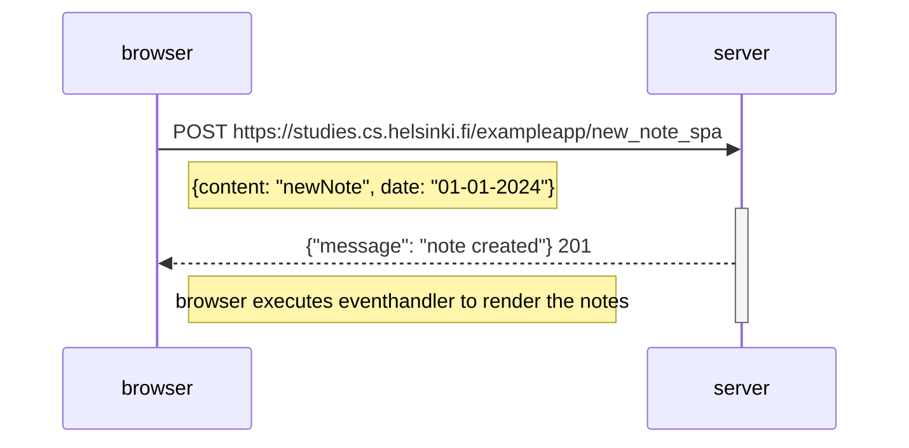

```mermaid
sequenceDiagram

participant browser
participant server

    browser->>server: POST https://studies.cs.helsinki.fi/exampleapp/new_note_spa
    Note right of browser: {content: "newNote", date: "01-01-2024"}
    activate server
    server-->>browser: {"message": "note created"} 201
    Note right of browser: browser executes eventhandler to render the notes
    deactivate server
```
