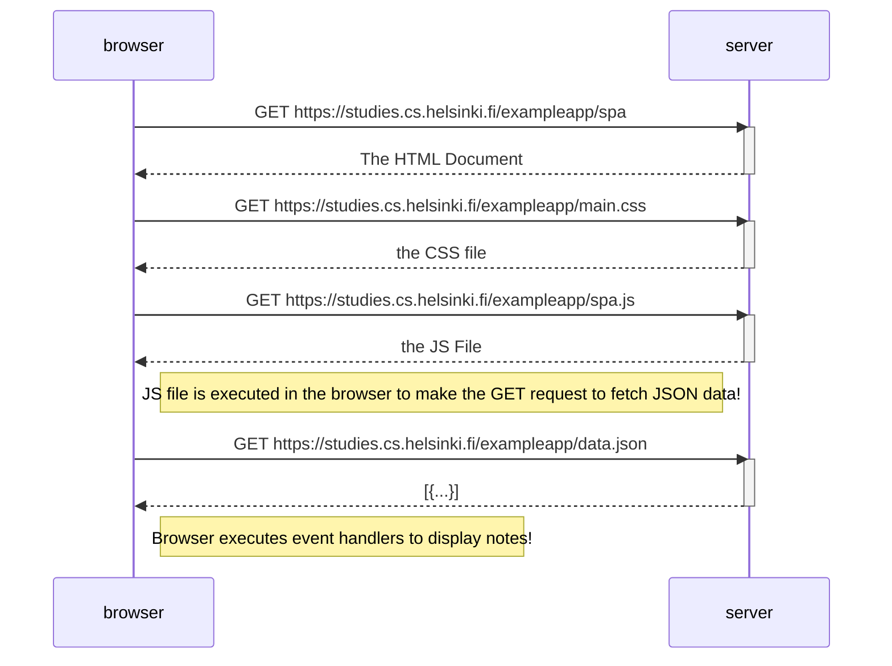

```mermaid
sequenceDiagram

participant browser
participant server

    browser->>server: GET https://studies.cs.helsinki.fi/exampleapp/spa
    activate server
    server-->>browser: The HTML Document
    deactivate server

    browser->>server: GET https://studies.cs.helsinki.fi/exampleapp/main.css
    activate server
    server-->>browser: the CSS file
    deactivate server

    browser->>server: GET https://studies.cs.helsinki.fi/exampleapp/spa.js
    activate server
    server-->>browser: the JS File
    deactivate server

    Note right of browser: JS file is executed in the browser to make the GET request to fetch JSON data!

    browser->>server: GET https://studies.cs.helsinki.fi/exampleapp/data.json
    activate server
    server-->>browser: [{...}]
    deactivate server

    Note right of browser: Browser executes event handlers to display notes!
```
